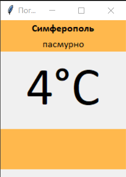
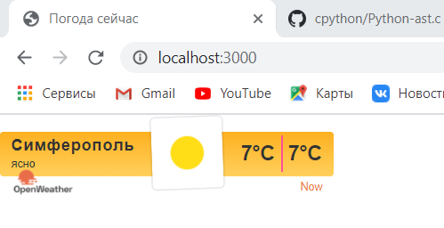

МИНИСТЕРСТВО НАУКИ  И ВЫСШЕГО ОБРАЗОВАНИЯ РОССИЙСКОЙ ФЕДЕРАЦИИ 
Федеральное государственное автономное образовательное учреждение высшего образования 
"КРЫМСКИЙ ФЕДЕРАЛЬНЫЙ УНИВЕРСИТЕТ им. В. И. ВЕРНАДСКОГО" 
ФИЗИКО-ТЕХНИЧЕСКИЙ ИНСТИТУТ 
Кафедра компьютерной инженерии и моделирования

 
<h3 align="center">Отчёт по лабораторной работе № 1 по теме: Погода по дисциплине "Программирование"</h3>
  

студента 1 курса группы ПИ-б-о-202(2) 
Мустафаева Мухаммеда Мустафаевича 
направления подготовки 09.03.04 "Программная инженерия"

  
<table>
<tr><td>Научный руководитель  старший преподаватель кафедры  компьютерной инженерии и моделирования</td>
<td>(оценка)</td>
<td>Чабанов В.В.</td>
</tr>
</table>
  

Симферополь, 2020

<!--  -->
## Цель:

1. Изучить работу с API web-сервиса;
2. Изучить процесс работу данных в/из json;
3. Получить базовое представление о сетевом взаимодействии приложений.

## Постановка задачи
Разработать сервис предоставляющий данные о погоде в городе Симферополе на момент запроса. В качестве источника данных о погоде использовать: http://openweathermap.org/. В состав сервиса входит: серверное приложение на языке С++ и клиентское приложение на языке Python.

Серверное приложение (далее Сервер) предназначенное для обслуживания клиентских приложений и минимизации количества запросов к сервису openweathermap.org. Сервер должен обеспечивать возможность получения данных в формате JSON и виде html виджета (для вставки виджета на страницу будет использоваться iframe).

Клиентское приложение должно иметь графический интерфейс отображающий сведения о погоде и возможность обновления данных по требованию пользователя.

## Выполнение работы

Для начала был зарегистрирован аккаунт openwheatermap.org. Создали API ключ:
79098fcb5f0dc19e0d40cf2a2d95fefc.

Далее по тренировались с запросами.

Запрос, созданный к серверу погоды включает в себя широту и долготу места, для которого необходимо получить погоду, исключить все типы прогноза кроме почасового, ключ API, метрические единицы изменения (градус цельсий) и описание на русском языке:  http://api.openweathermap.org/data/2.5/onecall?lat=44.95&lon=34.1&exclude=current,minutely,daily,alerts&units=metric&appid=22389633fb751386c21964f218dee229&lang=ru .

Запрос для сервера погоды включает в себя город, время которого необходимо получить: http://worldtimeapi.org/api/timezone/Europe/Simferopol

Исходный код сервера:

#include <iostream>
#include "cpp-httplib/httplib.h"
#include "nlohmann/json.hpp"
#include <iomanip>
#include <string>
#include <ctime>
#include <fstream>

using json = nlohmann::json;
using namespace httplib;
using namespace std;

void replace_in_html(string &str, string what_replace, string on) {
    size_t a = str.find(what_replace);
    while (a != std::string::npos) {
        str.replace(a, what_replace.size(), on);
        a = str.find(what_replace, a + on.size());
    }
}

json get_time_json() {
    // Создаём клиент и привязываем к домену. Туда пойдут наши запросы
    Client cli("http://worldtimeapi.org");
    // Отправляем get-запрос и ждём ответ, который сохраняется в переменной res
    auto res = cli.Get("/api/timezone/Europe/Simferopol");
    // res преобразуется в true, если запрос-ответ прошли без ошибок
    if (res) {
        // Проверяем статус ответа, т.к. может быть 404 и другие
        if (res->status == 200) {
            // В res->body лежит string с ответом сервера
            json res_j = json::parse(res->body);
            return res_j;
        }
        else {
            std::cout << "Status code: " << res->status << std::endl;
        }
    }
    else {
        auto err = res.error();
        std::cout << "Error code: " << err << std::endl;
    }
}

json get_weather_json() {
    // Создаём клиент и привязываем к домену. Туда пойдут наши запросы
    Client cli("http://api.openweathermap.org");
    // Отправляем get-запрос и ждём ответ, который сохраняется в переменной res
    auto res = cli.Get("/data/2.5/onecall?lat=44.95&lon=34.1&exclude=current,minutely,daily,alerts&units=metric&appid=22389633fb751386c21964f218dee229&lang=ru");
    // res преобразуется в true, если запрос-ответ прошли без ошибок
    if (res) {
        // Проверяем статус ответа, т.к. может быть 404 и другие
        if (res->status == 200) {
            // В res->body лежит string с ответом сервера
            json res_j = json::parse(res->body);
                               
            return res_j;
        }
        else {
            std::cout << "Status code: " << res->status << std::endl;
        }
    }
    else {
        auto err = res.error();
        std::cout << "Error code: " << err << std::endl;
    }
}

json get_cache() {
    json cache;
    ifstream r_cache("cache.json");
    if (r_cache.is_open()) {
        string str;
        getline(r_cache, str, '\0');
        if (!str.empty()) cache = json::parse(str);

        r_cache.close();
        return cache;
    }
    else return { "error" };
}
bool c_w_json(json str) {
    ofstream cache_file("cache.json");
    if (cache_file.is_open()) {
        cache_file << str;
        cache_file.close();
        return true;
    }
    return false;
}

json get_hour(json j) {
    json hour;
    int time;
    int last_index = j.size() - 1;
    json tj = get_time_json();
    if (tj["err"].is_null()) {
        time = tj["unixtime"];
    }
    else time = std::time(0);
    if (j[last_index]["dt"] < time) return json::object();
    for (int i = 0; i < last_index; i++) {
        if (j[i]["dt"] >= time) {
            hour = j[i];
            break;
        }
    } return time;
}

void gen_response(const Request& req, Response& res) {
    json body = get_cache();
    json weather;

    if (body.empty()) {
        body = get_weather_json();
        if (!body["err"].is_null()) {
            res.set_content(body["err"], "text/plain");
            return;
        }
        c_w_json(body);
    }
    else if (!body["err"].is_null()) {
        res.set_content(body, "text/json");
    }
    
    weather = get_hour(body["hourly"]);
    

    
    
    
    
   

    ifstream op_html;
    op_html.open("index.html");
    string str;
    if (op_html.is_open())
    {
        getline(op_html, str, '\0');
        op_html.close();
    }
    else
    {
        res.set_content("error, please try again", "text/plain");
        return;
    }

    json n = get_weather_json();   
    replace_in_html(str, "{hourly[i].weather[0].description}", n["hourly"][0]["weather"][0]["description"]);
    replace_in_html(str, "{hourly[i].weather[0].icon}", n["hourly"][0]["weather"][0]["icon"]);
    replace_in_html(str, "{hourly[i].temp}", to_string(int(std::round(n["hourly"][0]["temp"].get<double>()))));
  
    res.set_content(str, "text,html");
}

void gen_response_raw(const Request& req, Response& res) {

    json body = get_cache();
    json end;
    end["temp"] = to_string(int(round(body["hourly"][0]["temp"].get<double>())));
    end["description"] = body["hourly"][0]["weather"][0]["description"];
    res.set_content(end.dump(), "text/json;charset=utf-8");

}

int main() {
    //get_weather_json();
    Server svr;                    // Создаём сервер (пока-что не запущен)
	svr.Get("/", gen_response);    // Вызвать функцию gen_response если кто-то обратиться к корню "сайта"
    svr.Get("/raw", gen_response_raw);
    std::cout << "Start server... OK\n";
    svr.listen("localhost", 3000); // Запускаем сервер на localhost и порту 1234
}

<h5 align="center">Рисунок 1: Скриншот клиента.</h5>

<h5 align="center">Рисунок 2: Скриншот виджета.</h5>
## Вывод по работе. 
- Создали сервер на языке С++, обращающегося к openweathermap.com и возвращающий виджет или описание и температуру в формате json
- Приложение с графическим интерфейсом, написанное на языке Python с использованием библиотеки Tkinter, получающее и обрабатывающее данные из сервера.
